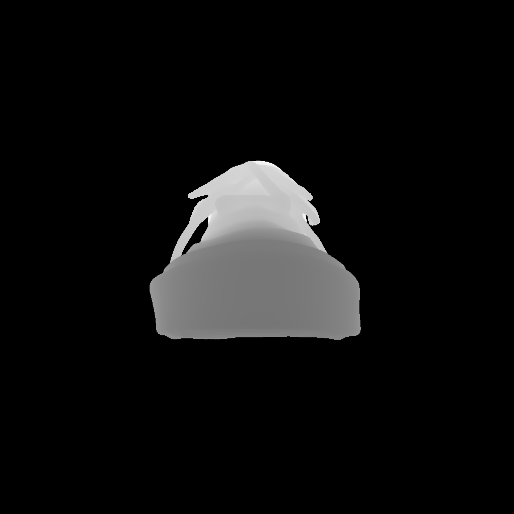
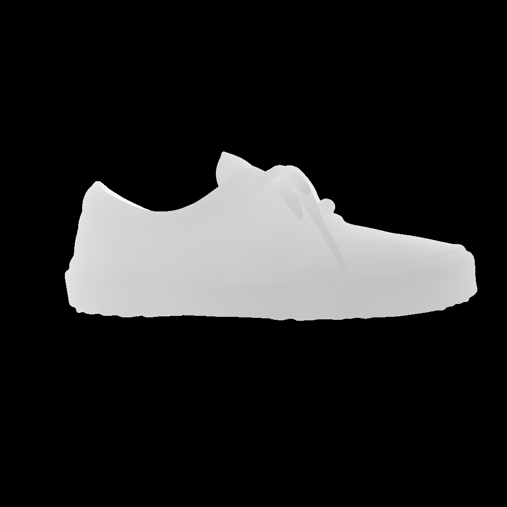

# RebuilderAI - 송찬영 과제

## Task

"첨부드린 다시점 이미지에 대해 아래 두 모델을 돌려서 textured mesh를 각각 취득해 보는 과업입니다.
각 이미지는 에셋을 중앙에 배치하고 정확한 +x, -x, +y, -y, +z, -z 축 방향 perspective camera로 렌더링되었습니다."

- https://github.com/estheryang11/ReconViaGen
- https://github.com/NVlabs/nvdiffrec

## Input data

<h3>Multi-View Images</h3>
<table width="100%">
  <tr>
    <th width="16%">
Front
</th>
    <th width="16%">
Back
</th>
    <th width="16%">
Left
</th>
    <th width="16%">
Right
</th>
    <th width="16%">
Top
</th>
    <th width="16%">
Bottom
</th>
  </tr>
  <tr>
    <td align="center"></td>
    <td align="center"></td>
    <td align="center"></td>
    <td align="center"></td>
    <td align="center"></td>
    <td align="center"></td>
  </tr>
</table>

<h3>Masks</h3>
<table width="100%">
  <tr>
    <th width="16%">
Front
</th>
    <th width="16%">
Back
</th>
    <th width="16%">
Left
</th>
    <th width="16%">
Right
</th>
    <th width="16%">
Top
</th>
    <th width="16%">
Bottom
</th>
  </tr>
  <tr>
    <td align="center"></td>
    <td align="center"></td>
    <td align="center"></td>
    <td align="center"></td>
    <td align="center"></td>
    <td align="center"></td>
  </tr>
</table>

## Output Results

-   [ReconViaGen](./ReconViaGen/notes.md)
-   [nvdiffrec](./nvdiffrec/notes.md)
