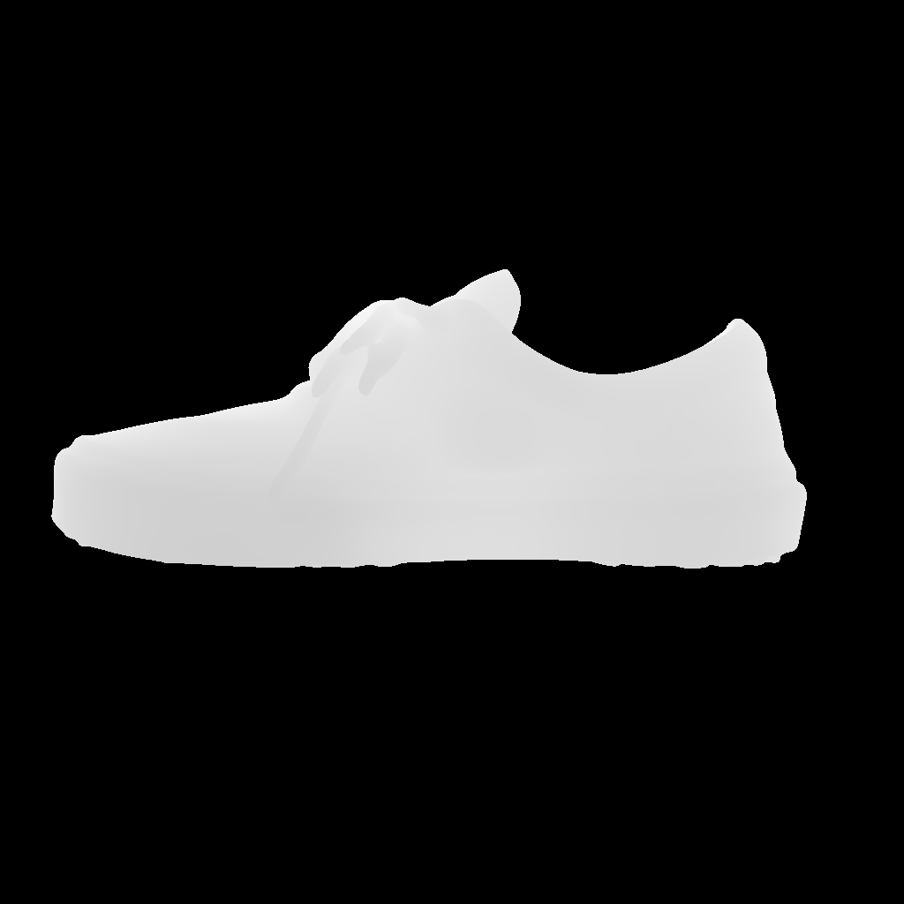
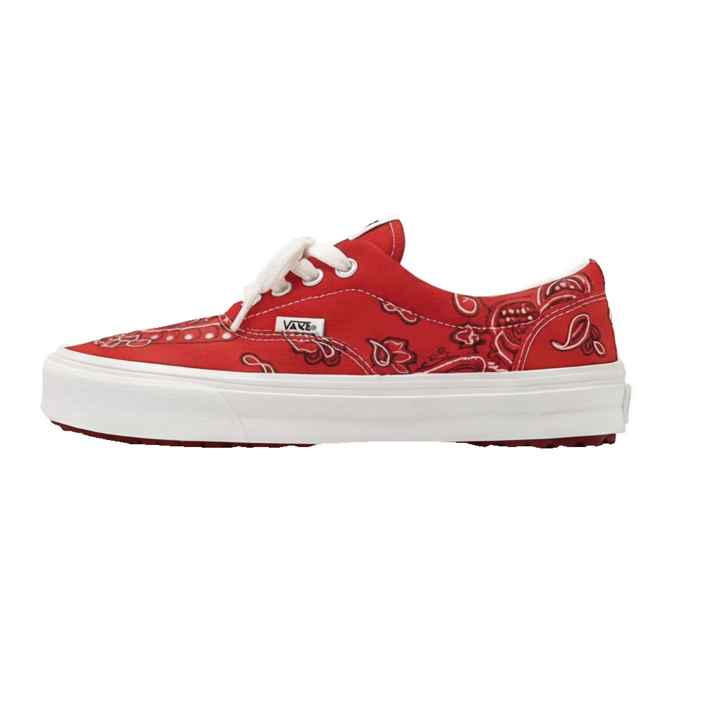
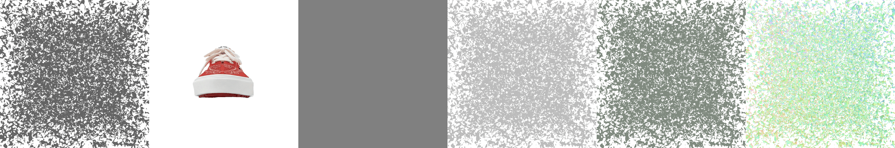

# [nvdiffrec](https://github.com/NVlabs/nvdiffrec)

## Page Navigation

-   [Home](../README.md)
-   [ReconViaGen](../ReconViaGen/README.md)
-   [nvdiffrec](./nvdiffrec/README.md)

## Installation notes

```bash
conda create -n dmodel python=3.10 -y
activate dmodel
conda install pytorch torchvision torchaudio -c pytorch -c conda-forge -y
pip install ninja imageio PyOpenGL glfw xatlas gdown
pip install git+https://github.com/NVlabs/nvdiffrast/ --no-build-isolation
pip install git+https://github.com/NVlabs/tiny-cuda-nn#subdirectory=bindings/torch
```

### If tiny-cuda-nn installation fails (C++17 issue on RTX 3060), do the following steps:

1. `git clone --recursive https://github.com/NVlabs/tiny-cuda-nn`
1. Patch setup.py (Force C++17) Run this command to replace the 14 with 17 in the bindings setup file you just shared:

    ```bash
    sed -i 's/cpp_standard = 14/cpp_standard = 17/g' bindings/torch/setup.py
    ```

1. Patch rtc_kernel.cu (Force C++17 for Runtime) This ensures the JIT compiler doesn't crash later when you run your code.

    ```bash
    sed -i 's/std=c++14/std=c++17/g' src/rtc_kernel.cu
    ```

1. Install Navigate to the bindings folder and install. (Note: We use pip install . to install the patched local version)

    ```bash
    cd bindings/torch

    # Prevent RAM crash
    export MAX_JOBS=1

    # Target your RTX 3060 specifically
    export TCNN_CUDA_ARCHITECTURES=86

    # Install!
    pip install . --no-build-isolation
    ```

## Data Preparation

### Removing the background

I used the depth map images provided in the dataset to create masks and remove the background from the RGB images creating a [process_images.py](../utils/process_images.py) script. The required process was:

-   Match(by upscaling) the resolution of depth maps to the RGB images.
-   I used 0 value pixels in the depth maps as the background and made those pixels transparent in the RGB images.

<table width="100%">
  <tr>
    <th width="33%"><div align="center">Original</div></th>
    <th width="33%"><div align="center">Depth map</div></th>
    <th width="33%"><div align="center">Background removed</div></th>
  </tr>
  <tr>
    <td align="center"></td>
    <td align="center"></td>
    <td align="center" style="background-color: green;"></td>
  </tr>
</table>

## transforms.json

```json
{
    "camera_angle_x": 0.85,
    "frames": [
        {
            "file_path": "./train/front",
            "transform_matrix": [
                [1, 0, 0, 0],
                [0, 1, 0, 0],
                [0, 0, 1, 3],
                [0, 0, 0, 1]
            ]
        },
        {
            "file_path": "./train/back",
            "transform_matrix": [
                [-1, 0, 0, 0],
                [0, 1, 0, 0],
                [0, 0, -1, -3],
                [0, 0, 0, 1]
            ]
        },
        {
            "file_path": "./train/left",
            "transform_matrix": [
                [0, 0, 1, 3],
                [0, 1, 0, 0],
                [-1, 0, 0, 0],
                [0, 0, 0, 1]
            ]
        },
        {
            "file_path": "./train/right",
            "transform_matrix": [
                [0, 0, -1, -3],
                [0, 1, 0, 0],
                [1, 0, 0, 0],
                [0, 0, 0, 1]
            ]
        },
        {
            "file_path": "./train/top",
            "transform_matrix": [
                [-1, 0, 0, 0],
                [0, 0, 1, 3],
                [0, 1, 0, 0],
                [0, 0, 0, 1]
            ]
        },
        {
            "file_path": "./train/bottom",
            "transform_matrix": [
                [1, 0, 0, 0],
                [0, 0, -1, -3],
                [0, 1, 0, 0],
                [0, 0, 0, 1]
            ]
        }
    ]
}
```

#### camera_angle_x

Field of view in radians. A typical FOV with mild distortion is around 49 degrees (0.85 radians).

#### transform_matrix

NeRF's Pose Matrix (Camera-to-World) 4x4 transformation matrix.

The Camera-to-World Matrix ($\mathbf{M}_{c2w}$)$$\mathbf{M}_{c2w} = 
\begin{bmatrix}
\mathbf{r}_x & \mathbf{u}_x & \mathbf{b}_x & \mathbf{t}_x \\
\mathbf{r}_y & \mathbf{u}_y & \mathbf{b}_y & \mathbf{t}_y \\
\mathbf{r}_z & \mathbf{u}_z & \mathbf{b}_z & \mathbf{t}_z \\
0 & 0 & 0 & 1
\end{bmatrix}$$

1. Column 4: The Position ($\mathbf{t}$)

    The last column ($\mathbf{t}$) represents the Camera's Translation (position) in world space.

2. Columns 1-3: The Orientation (Rotation)

    The first three columns represent the camera's local axes—Right, Up, and Back—expressed in World Coordinates.

    - Column 1 ($\mathbf{r}$): The Right Vector. This vector points to the immediate right of the camera.
    - Column 2 ($\mathbf{u}$): The Up Vector. This vector points directly out of the top of the camera.
    - Column 3 ($\mathbf{b}$): The Backward Vector. This requires special attention regarding conventions:

I created a [check_cameras.py](../utils/check_cameras.py) util script to plot the matrices to visualize the camera poses. This helped to verify that the images were aligned correctly with the camera poses except the `top` view which was upside down. I fixed this by reversing the rotation matrix for the top view as follows:

From

```
[
    [1, 0, 0, 0],
    [0, 0, -1, -3],
    [0, 1, 0, 0],
    [0, 0, 0, 1]
]
```

To

```
[
    [-1, 0, 0, 0],
    [0, 0, -1, -3],
    [0, -1, 0, 0],
    [0, 0, 0, 1]
]
```

Resulting in:


The `3` in the translation vector represents the distance of the camera from the origin along the Z-axis. I chose this value based on trial and improvement(1~4) to ensure that the object fit well within the camera's view.

### Config file

```json
{
    "ref_mesh": "data/shoe",
    "random_textures": true,
    "iter": 5000,
    "save_interval": 100,
    "texture_res": [1024, 1024],
    "train_res": [1024, 1024],
    "batch": 2,
    "learning_rate": [0.03, 0.01],
    "ks_min": [0, 0.08, 0.0],
    "dmtet_grid": 128,
    "mesh_scale": 2.1,
    "laplace_scale": 3000,
    "display": [
        { "latlong": true },
        { "bsdf": "kd" },
        { "bsdf": "ks" },
        { "bsdf": "normal" }
    ],
    "background": "white",
    "out_dir": "shoe_5000iter_d3_1024"
}
```

## System requirements

On my RTX 3060 laptop GPU with 12GB VRAM, I had to limit the training resolution from 2048x2048 to 1024x1024 and batch size from 6 to 2 to avoid out-of-memory errors.

## Output

### Training process:



### Output model preview


### Online viewer

Click [HERE](https://3dviewer.net/index.html#model=https://cdn.jsdelivr.net/gh/chanyoungs/rebuilderai-recon@main/nvdiffrec/outputs/shoe_5000iter_d3_1024/mesh/mesh.obj,https://cdn.jsdelivr.net/gh/chanyoungs/rebuilderai-recon@main/nvdiffrec/outputs/shoe_5000iter_d3_1024/mesh/mesh.mtl,https://cdn.jsdelivr.net/gh/chanyoungs/rebuilderai-recon@main/nvdiffrec/outputs/shoe_5000iter_d3_1024/mesh/texture_kd.png,https://cdn.jsdelivr.net/gh/chanyoungs/rebuilderai-recon@main/nvdiffrec/outputs/shoe_5000iter_d3_1024/mesh/texture_ks.png,https://cdn.jsdelivr.net/gh/chanyoungs/rebuilderai-recon@main/nvdiffrec/outputs/shoe_5000iter_d3_1024/mesh/texture_kn.png)

### Download model

Click [HERE](https://cdn.jsdelivr.net/gh/chanyoungs/rebuilderai-recon@main/nvdiffrec/outputs/shoe_5000iter_d3_1024/mesh/shoe_nvdiffrec.zip)

## Dev time

~10 hours

## [Return to main](../README.md)
